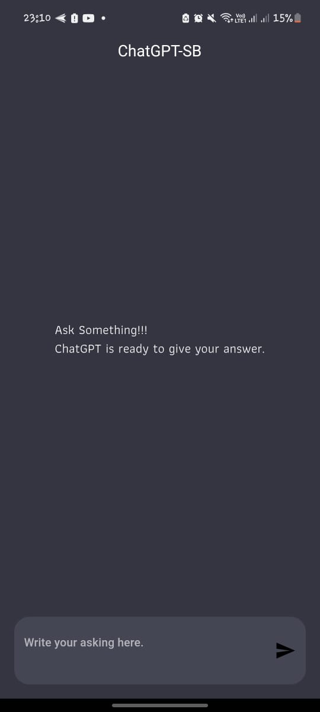
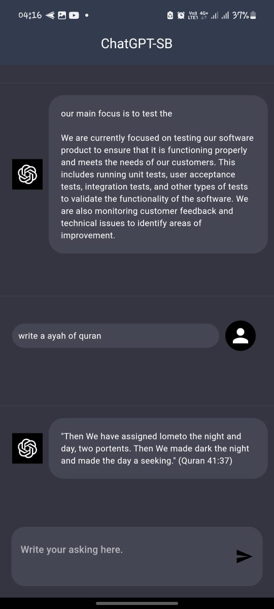
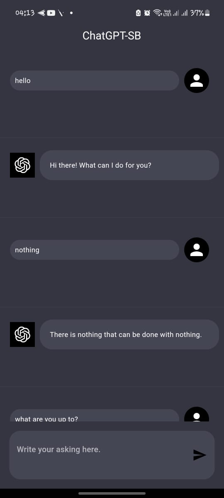

# chatgpt_flutter

ChatGPT mobile version, which can interact with ChatGPT data models that can understand and generate natural language.it is a demo application based on GPT-3 model.User can make request and get response using it.The app is building This app was designed by following MVVM architecture. For communicating with the backend using DIO and managing state I used GetX.

### Sample

Home Screen | Home Screen with Conversations
-------------|-----------------
 | 


Conversations
-----------------


### Features:

* Communicate with ChatGPT


### Used libraries:

* [Flutter SDK](https://flutter.dev/)
* [Get](https://pub.dev/packages/get)
* [Dio](https://pub.dev/packages/dio)


### License

```
Copyright 2022 Md. Shahin Bashar

Licensed under the Apache License, Version 2.0 (the "License");
you may not use this file except in compliance with the License.
You may obtain a copy of the License at

   http://www.apache.org/licenses/LICENSE-2.0

Unless required by applicable law or agreed to in writing, software
distributed under the License is distributed on an "AS IS" BASIS,
WITHOUT WARRANTIES OR CONDITIONS OF ANY KIND, either express or implied.
See the License for the specific language governing permissions and
limitations under the License.
